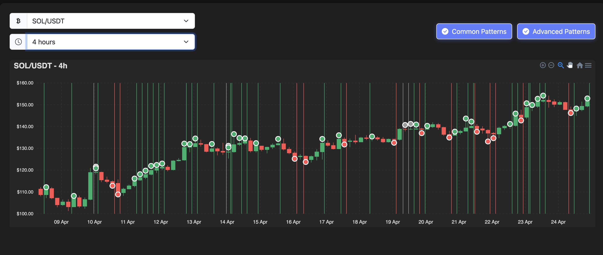

# Crypto Candlestick Pattern Analyzer

A real-time cryptocurrency candlestick pattern detection and visualization tool that helps traders identify technical patterns directly on charts.



## Features

- **Real-time Cryptocurrency Data**: Connects to Binance API to fetch live candlestick (OHLC) data
- **Interactive Charting**: Visualizes candlestick data with zooming, panning, and tooltips
- **Automated Pattern Detection**: Identifies both common and advanced candlestick patterns
- **Pattern Categorization**: Organizes patterns by type (common/advanced) and sentiment (bullish/bearish/neutral)
- **Pattern Visualization**: Displays detected patterns directly on the chart with clear annotations
- **Customizable Display**: Toggle different pattern types on/off based on your analysis needs
- **Rich Tooltips**: Detailed information about both candles and detected patterns on hover
- **Responsive Design**: Works on desktop and mobile devices
- **Dark/Light Theme**: Choose your preferred viewing mode

## Supported Patterns

### Common Patterns
- Doji
- Hammer
- Shooting Star
- Bullish Engulfing
- Bearish Engulfing
- Morning Star
- Evening Star

### Advanced Patterns
- Three White Soldiers
- Three Black Crows
- Bullish Harami
- Bearish Harami
- Tweezers Top
- Tweezers Bottom

## Technology Stack

- **Frontend**: HTML5, CSS3, JavaScript (ES6+)
- **Charting**: ApexCharts.js
- **API**: Binance REST API
- **Styling**: Bootstrap 5 + Custom CSS
- **Icons**: Bootstrap Icons

## Getting Started

### Prerequisites
- Web browser with JavaScript enabled
- Internet connection to fetch data from Binance API

### Installation

1. Clone this repository:
```bash
git clone https://github.com/yourusername/crypto-candlestick-pattern.git
```

2. Navigate to the project directory:
```bash
cd crypto-candlestick-pattern
```

3. Open `index.html` in your browser or use a local server:
```bash
# Using Python:
python -m http.server 8000

# Or with Node.js:
npx serve
```

## Usage

1. **Select Cryptocurrency**: Choose from popular trading pairs like BTC/USDT, ETH/USDT, etc.
2. **Choose Timeframe**: Select your preferred interval (1m, 5m, 15m, 1h, 4h, 1d)
3. **Toggle Pattern Types**: Show/hide common or advanced patterns as needed
4. **Analyze Patterns**: Hover over annotations to see detailed pattern information
5. **Navigate the Chart**: Zoom and pan to analyze historical data at different scales
6. **Switch Themes**: Use the theme toggle to switch between light and dark modes

## How Pattern Detection Works

The application uses JavaScript-based algorithms to analyze candlestick formations and identify patterns based on the following:

- Candle body size and position
- Shadow (wick) length ratios
- Multi-candle relationships and sequences
- Price movement direction

When a pattern is detected, it's annotated directly on the chart with color-coded markers:
- 🟢 Green markers for bullish patterns
- 🔴 Red markers for bearish patterns
- ⚪ Grey markers for neutral patterns

## License

This project is licensed under the MIT License - see the LICENSE file for details.

## Acknowledgments

- [Binance API](https://github.com/binance/binance-spot-api-docs) for cryptocurrency data
- [ApexCharts](https://apexcharts.com/) for the interactive charting library
- [Bootstrap](https://getbootstrap.com/) for styling components
